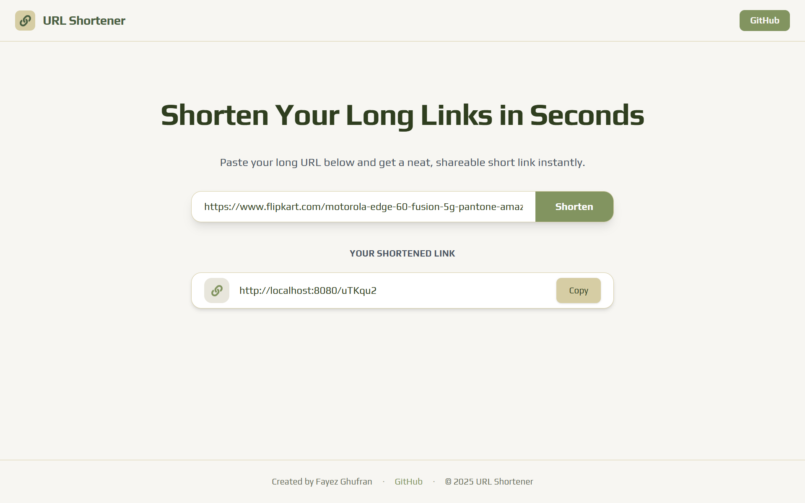

# URL Shortener

A simple and lightweight **URL Shortener** application built using **Spring Boot** for the backend and **ReactJS** for the frontend. This project converts long URLs into short, shareable links and allows users to retrieve or redirect to the original URL quickly.

---

## 🌟 Features

- Convert any long URL into a **unique short link**.
- Retrieve and redirect to the **original URL**.
- **Copy short URLs** instantly to the clipboard.
- Responsive and **clean ReactJS user interface**.
- RESTful API built with **Spring Boot**.
- CORS enabled for frontend-backend communication.

---

## 🛠️ Tech Stack

**Backend:**  
- Spring Boot  
- Spring Data JPA  
- MySQL  

**Frontend:**  
- ReactJS  
- Tailwind CSS  
- React Icons  

---

## ⚙️ Setup & Installation

### Backend (Spring Boot)

1. Navigate to backend folder:

```bash
cd url-shortener-backend/urlshortener
```

2. Configure MySQL in application.properties:

3. Run the Spring Boot app:

```bash
./mvnw spring-boot:run
```

### Frontend (ReactJS)

1. Navigate to frontend folder:

```bash
cd url-shortener-frontend
```

2. Install dependencies:
```bash
npm install
```

3. Start the React app:
```bash
npm run dev
```

## 📸 Screenshots 

  

